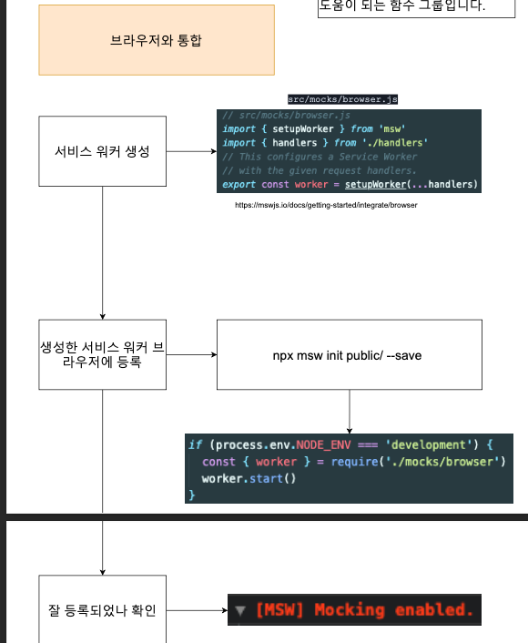
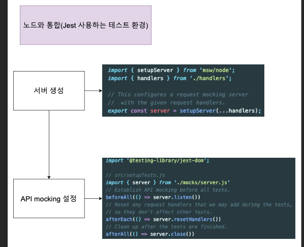

# inflearn 강의 정리
따라하며 배우는 리액트 테스트 학습 정리
> https://inf.run/giDV

## 프로젝트 세팅
해당 강의 기준으로,  
react-create-app으로 자동으로 생성된 `package.json`에 정의되어 있는 eslint 관련 세팅 부분을 삭제하고,  
`.eslintrc.json`파일을 만들어 그 부분에 정의한다.

그 다음, 다음 플러그인을 설치하고, `.eslintrc.json`파일에 추가(`plugins`)하고, 사용하도록 규칙을 설정(`extends`)한다.
```shell
npm install eslint-plugin-testing-library eslint-plugin-jest-dom --save-dev
```
근데 WebStorm 문제인지는 몰라도 다음의 에러가 계속 뜬다.  
`ESLint: TypeError: this.libOptions.parse is not a function`

그래서 추가로 eslint의 버전을 8.22.0로 깔면 된다는 말이있어 설치해서 사용해봤더니 해결됨.

```shell
npm install eslint@8.22.0 --save-exact
```
> https://stackoverflow.com/questions/73509984/eslint-typeerror-this-liboptions-parse-is-not-a-function

## Mock Service Worker
백엔드에서 데이터를 가져오는 부분을 테스트하기 위해서는 실제로 서버에 호출하는 end-to-end 테스트를 할 수 있지만,  
여기서는 서버에 요청을 보낼 때 그 요청을 가로채서 `Mock Service Worker`라는 것으로 요청을 처리하고 모의 응답을 받을 수 있다.
> https://mswjs.io/

### MSW 동작 방식
브라우저에 서비스 워커를 등록하여 외부로 나가는 네트워크 리퀘스트를 감지하고,  
그 요청을 실제 서버로 갈때 중간에 가로채서(intercept) MSW 클라이언트 사이드 라이브러리로 보낸다.  
그 후, 등록된 **핸들러에서** 요청을 처리한 후 모의 응답을 브라우저로 보낸다. 

작동하는 방식은 두 가지가 있다.
1. 서비스 워커를 브라우저에 등록한 다음 리퀘스트를 보낼 때 감지하고 가로채서, 요청을 처리한 다음 브라우저로 response를 보내는 방법 (첫 번째 이미지)
2. MSW에서 따로 서버를 만들어서 그 서버에 보낸 후, 처리하게 한 다음 response를 보내는 방법(두 번째 이미지)




### MSW 등록
server 응답을 mocking을 딴 작업한 것(handler)을 server에 등록해야 한다.    
즉, server에서 응답을 뭘 내려줄지 사전에 정의해두는 작업을 해야 되는 것이다.

해당 프로젝트에선 다음과 같이 작업 했다.
1. mocks/handlers.ts 파일에 응답 mocking(`handler`)을 생성한다.
2. mocks/server.ts 파일에 정의한 핸들러를 세팅한다(`setupServer`).
3. setupTests.ts 파일에 server를 import 후, beforeAll, afterEach, afterEach에 등록할 수 있다. => JUnit이랑 비슷.

### userEvent
-`userEvent.clear()`-  
input이나 textarea에 텍스트를 선택(select)한 후 제거(delete)해준다.  
userEvent를 앞서 사용했다면 다시 사용하기 전에 `clear`를 해준 후에 `userEvent.type()`를 해주는 것이 좋다.

### context, provider
`Provider`값에 `value`를 전달할 때 `useMemo`를 사용하는 이유는 `Provider`의 `value`가 바뀌면  
`Provider` 안의 컴포넌트들은 리렌더링이 일어나게 된다. 즉, 민감하게 값이 바뀌면 리렌더링이 계속 일어나는 것이다.
`useMemo`를 사용해서 `dependency`를 걸면 `dependency`가 변해야만 렌더링이 일어나게 하는 것이다.

`provider, context`를 테스트에 적용하려면 컴포넌트를 감싸야되는데 `render`함수의 옵션에서 `wrapper`에 `Provider`를 제공하면 된다.  
일일이 render에 적용하기 힘들다면 `custom-render` 사용을 추천한다.

> https://testing-library.com/docs/react-native-testing-library/setup/#custom-render

### ARIA: spinbutton role
처음 들어보고 몰라서 한 번 찾아봤다. MDN에서는 다음과 같이 설명한다. 
> 사용자가 불연속 선택 중에서 값을 선택하기를 기대하는 범위 유형을 정의합니다. 

한글만 봐서는 이해가 잘 안된다. 쉽게 풀이하면 다음과 같다.  
`input`의 `type`이 `number`로 되어있다면 html에서 증감버튼이 생긴다. 여기서 제한되게 컨트롤 할 수 있게 강제하는 버튼인 것이다.     
해당 프로젝트에서는, `findByRole`을 사용해서 찾을 때 `spinbutton`으로 role들을 찾고, `name` 속성을 이용해서 테스트할 항목을 찾은 것이다.

> https://developer.mozilla.org/en-US/docs/Web/Accessibility/ARIA/Roles/spinbutton_role  
> https://www.digitala11y.com/spinbutton-role/

# 트러블 슈팅
#### SyntaxError: Cannot use import statement outside a module
테스트 코드를 진행하던 도중 위의 오류를 마주쳤다.  
axios 라이브러리를 추가하고 import를 함에 있어 import구문을 해석하지 못해 구문 에러가 발생한 것이었다.  
`babel-jest`는 node_modules 아래에 있는 모듈의 변환을 고려(또는 무시)하지 않기에 package.json 파일에 `"type": "module"` 추가는 도움이 되지 않았다.

그렇다고 따로 `jest.config.js`파일을 추가해서 따로 설정하기는 싫어서, 검색을 좀 해보니 test script를 돌릴 때 다음 옵션을 주면 된다. 
- transformIgnorePatterns

파일 경로가 패턴과 일치하면 변환하지 않는다는 config 옵션이다. 위의 옵션을 test script 돌릴 때 node_mudles를 제외하도록 적용하니 잘 적용 되었다.
```json
{ 
  // ...
  "scripts": {
    // ...
    "test": "react-scripts test --transformIgnorePatterns \"node_modules/(?!@codemirror)/\""
  } 
}
```

다음 링크를 참고했다.
> https://github.com/facebook/create-react-app/issues/9938

##### 22.10.24 추가 수정
스크립트를 실행할 때 `transformIgnorePatterns`패턴을 먹이는 방식으로 하면 `webstorm`에서 제공하는 테스트 코드 옆 `start`버튼을 눌러서 실행하는 기능엔 적용이 안 됨.  
그래서, package.json 파일에 jest config를 추가하도록 변경함.
```json
{
  "jest": {
    "transform": {
      "^.+\\.[t|j]sx?$": "babel-jest"
    },
    "transformIgnorePatterns": ["node_modules/(?!@shotgunjed)/"]
  }
}
```
위의 코드를 추가하고, `script`실행할 땐 따로 명령어를 주지 않도록 하고 하니, 잘 되는 것을 확인. 
